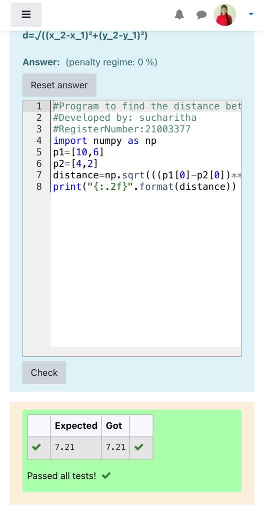

# DISTANCE-BETWEEN-TWO-POINTS

## AIM:
To write a python program to find the distance two 2 points
## ALGORITHM:
### Step 1: create the program
### Step 2: assign the values
### Step 3: substitute the values in distance formula
### Step 4: display the values
### Step 5: end the program 
### PROGRAM:
import numpy as np
p1=[10,6]
p2=[4,2]
distance=np.sqrt(((p1[0]-p2[0])*2)+((p1[1]-p2[1])*2))
print("{:.2f}".format(distance))

### OUTPUT:

### RESULT:

program sucessfully completed.